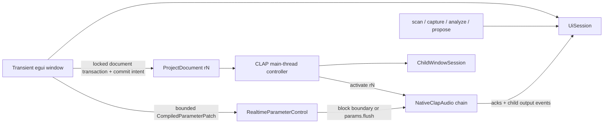

# Architecture Decision: Revisioned Audio-Agent Host

## Runtime ownership

Ghost separates durable project data, editor-session data, main-thread resources, and realtime
control. The separation is a lifecycle contract, not only a module layout.

- `ProjectDocument` (`ghost.ui-state/3`) is the only serialized model. It contains graph topology,
  assignments, nested child state, editor preferences, and a monotonically increasing graph
  revision. A frame renders while holding one document transaction; it never replaces a stale
  clone.
- `UiSession` belongs to the outer plugin instance and survives creation/destruction of the egui
  window. It owns scan results, stable selection identities, job receivers, capture/analysis,
  proposal preview, status, parameter feedback, and active/pending revision projections.
- `GhostEditorMainThread` owns non-Send child main-thread instances, state and GUI coordination,
  DAW callbacks, detached windows, and aggregate latency.
- `RealtimeParameterControl`, transport, capture, and bypass controls use atomics or bounded
  lock-free queues. The audio callback does not lock, scan, serialize, open windows, or call an
  agent.

Immediate-mode controls mutate the lock-owned document transaction. Structural controls set commit
intent; the frame increments the graph revision and publishes the pending revision before releasing
the lock and requesting a DAW restart. This is deliberately smaller than a general command bus, but
preserves the essential single-transaction and commit-before-effect rules.

## Graph activation and project load

`pending_graph_revision` names the newest committed document waiting for activation.
`active_graph_revision` names the chain actually processing. Activation reads a document snapshot,
builds children, publishes the active revision, and clears pending only when the same revision became
active. Loading project state accepts versions 1–3, migrates to version 3, assigns a revision greater
than both the loaded and current document, commits it, then requests restart.

`NativeClapMain` remains main-thread-only. `NativeClapAudio` is the sendable active half. Activation
splits them; deactivation reunites each matching pair before destruction. Structural edits rebuild
the chain. Bypass uses an atomic mask and does not require topology replacement.

## Proposal transaction

Propose is non-destructive. The semantic `MixPlan` is compiled into a
`CompiledParameterPatch` containing target node, expected graph revision, semantic field, concrete
CLAP parameter ID, plain value/range, confidence, previous value, and restart requirement.

Compilation requires one unambiguous assigned target and every required mapping. Missing or
ambiguous fields make the preview `Mapping incomplete`; partial application is rejected. Apply
captures bypass changes and queues one transaction of at most 32 concrete parameter changes. The
active processor preflights every revision/node/parameter before any mutation, applies at a block
boundary, and emits bounded acknowledgements. Bypass commits only after all acknowledgements pass.
When playback is stopped, Ghost advertises outer `clap.params`, requests a host flush, and forwards
that callback to each child's `params.flush`. Successful completion captures child state and marks
the outer project dirty. Undo constructs an inverse patch from acknowledged previous values.

Child-produced parameter output events are consumed into feedback telemetry. Matching feedback can
advance an applied transaction to `Verified`.

## Child GUI and nested host

Child editors are independent of the outer egui HWND:

1. Prefer plugin-owned Win32 floating mode, use the DAW/outer host window as transient owner, suggest
   a title, and show it.
2. Otherwise create a dedicated top-level Win32 container and embed the child there. The container
   negotiates and applies client size independently.
3. Track `Closed`, `PluginFloating`, `HostedDetached`, `CloseRequested`, and `Destroyed` states.

Destroying the outer editor destroys only its baseview window. Detached child editors remain owned
by the plugin instance. Child `request_resize`, `request_show`, `request_hide`, resize-hints, and
`closed(was_destroyed)` callbacks are routed to the matching window session.

The nested host also implements core restart/process/main-thread wakeups, parameter rescan/clear/
flush, state dirty, latency change, timer, thread-check, and log extensions. Events cross a bounded
queue into the outer main thread. Audio-thread log callbacks are intentionally dropped to avoid
allocation. Dynamic child latency is summed and reported through the outer latency extension;
changes request host restart.

## Transport, capture, and UI cadence

Transport publication uses a single-writer sequence protocol and retains availability flags for
tempo/increment, beat/seconds positions, bar start/number, signature, loop ranges, play/record/loop,
and pre-roll. The last intra-block transport event overrides the block header for publication and
child forwarding. The UI repaints at 25 Hz while visible, repaints immediately for active work, and
labels transport live/stale/unavailable. Displayed beat is `song_position_beats - bar_start + 1`.

Capture is fixed-capacity stereo input plus selected-tap storage. Stable FNV tap keys avoid string
work in the callback. A missing requested edge truthfully falls back to Output.

## Dependency direction

Domain and protocol types remain inward; CLAP, GUI, storage, daemon, and agent runtimes remain
adapters. `ghost-host` does not depend on the outer plugin: `NestedHostBridge` and bounded events are
its stable outward interface. `ghost-ui` depends on public host/domain contracts, not native window
or CLAP handles.

## Acceptance rules

1. No UI frame may clone/unlock/replace the complete project document.
2. A structural restart may be requested only after its new revision is committed.
3. No unbounded, locking, filesystem, GUI, serialization, or agent work enters `process`.
4. Incomplete semantic mappings never apply silently.
5. Tests inject mock/scripted transports and never launch Codex.
6. Proprietary plugin and FL Studio support is not called verified until the manual runbook passes.

Status: Redesign 03 implementation, 2026-08-07.
